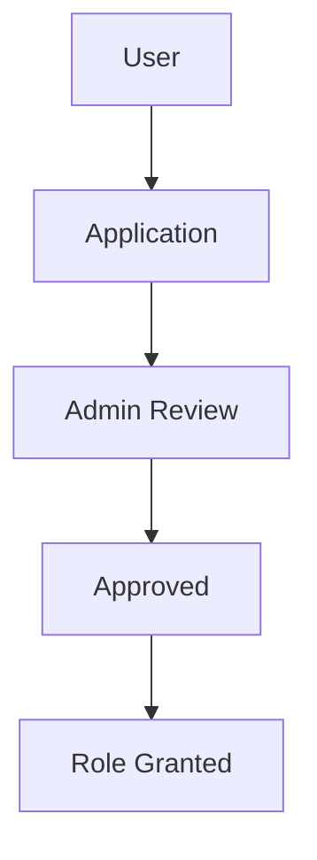

# Diagram Standards

Mermaid is the canonical diagram source.

## Supported Diagram Types

- Flowcharts
- ER diagrams
- Sequence diagrams
- State diagrams
- Component diagrams

## Mermaid Source

Store reusable Mermaid source in `documentation/diagrams/` using `.mmd` files.

## Example

## Conventions

- Use readable node labels.
- Keep diagrams focused on one workflow.
- Use `SeasonClub` for competitive participation and `Club` for brand identity.
- Include diagram version and owner in nearby Markdown when diagrams become operationally important.

